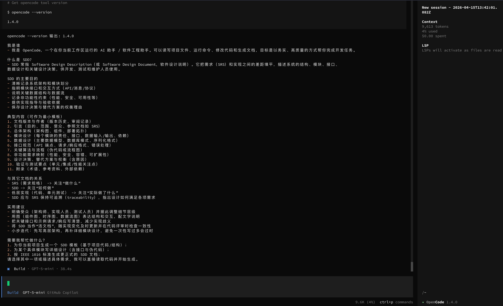

## 任务 1：安装 OpenCode 并完成环境配置
安装 OpenCode（参考 GitHub README），配置国产模型 API （推荐 DeepSeek，也可选 Qwen/GLM/Kimi）。截图验证：opencode --version + 第一次对话成功。

> 作业提交：


## 任务 2：对比实验：裸 API 调用 vs OpenCode 编排
用 Python 直接调用模型 API 完成一个小任务（如分析一段代码），再用 OpenCode 完成同一个任务。
对比两者的差异，写一段 200 字的体会：你感受到了什么是“无状态”和“有状态”

> 作业提交：
```text
简单来说，有无状态其实就是有没有上下文。

无状态（Stateless）：每次调用彼此独立，没有记忆。模型 API 调用就是典型的无状态——我们每次发请求都要把完整上下文塞进去，模型不记得上一轮说了什么，请求结束即遗忘。

有状态（Stateful）：系统维护了对话/任务的上下文状态，多轮交互之间有连续性。OpenCode 这类 Agent 框架会在内部维护对话历史、工具调用记录、任务进度等状态，模型"知道"之前发生了什么，可以跨步骤推理和决策。
```