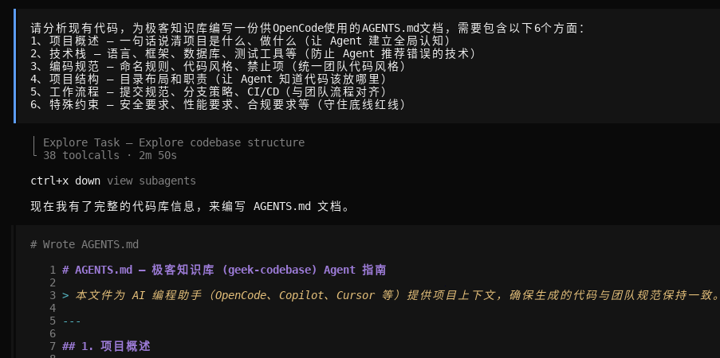
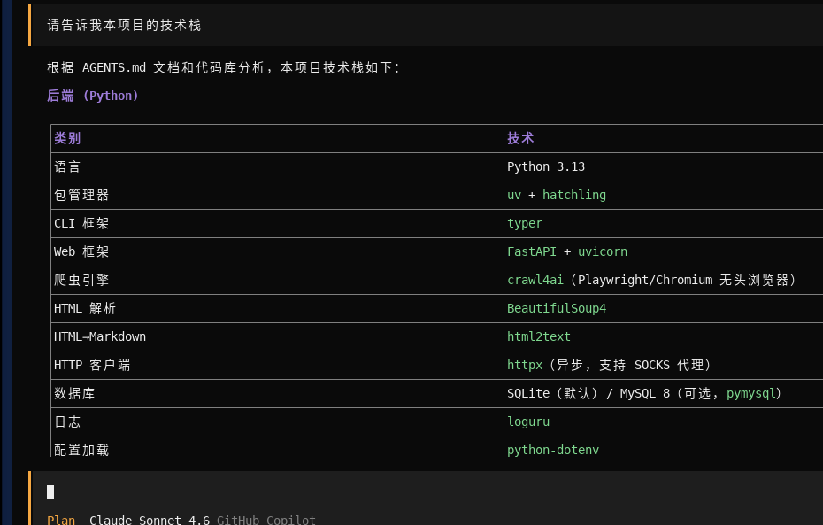
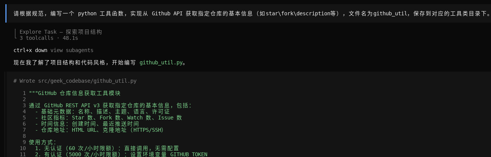
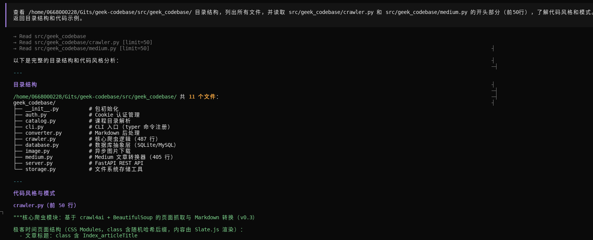
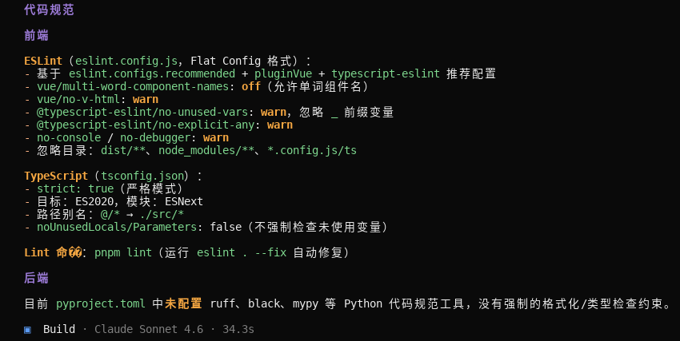
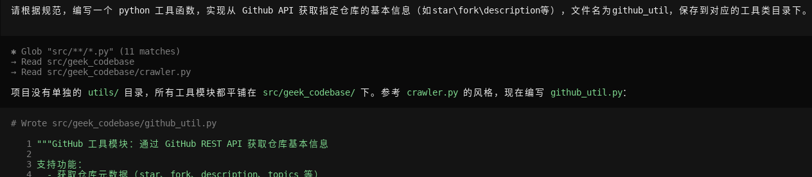
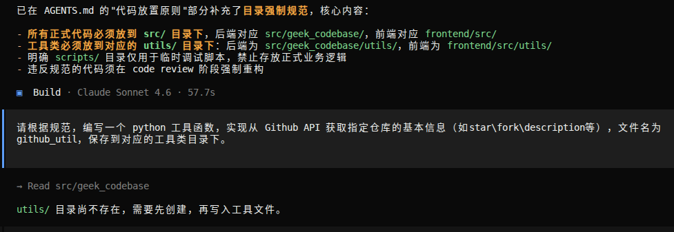

# Memory 工程

## 任务 1：为你的项目编写 AGENTS.md
选择一个你正在做的项目（或创建一个新项目），按照 6 个组成部分的框架，编写一份完整的 AGENTS.md。至少包含：项目概述、技术栈、编码规范、项目结构。

> 作业提交

1、编写提示

2、查询技术栈

## 任务 2：对比实验：有 Memory vs 无 Memory
在 OpenCode 中，分别在有 AGENTS.md 和删除 AGENTS.md 的情况下，给出同样的编程指令（如“编写一个用户登录接口”），对比两次产出的代码质量、代码风格和规范遵守程度。截图记录差异。

> 作业提交

第一次有AGENTS.md文件情况下：

第二次移除AGENTS.md文件后重新测试：

1、没有查找到技术栈和规范

2、参考现有代码风格直接编写

输出对比：第一次由于有AGENTS.md，考虑更深入，生成代码质量也较好。

## 任务 3：思考题：你的 Memory 遗漏了什么？
在使用 Agent 的过程中，观察它是否产出了不符合你期望的代码。如果有，思考是 AGENTS.md 里缺了什么规则，然后补充上去。

> 作业提交如下：

不符合期望的地方：util文件没有放到专有的目录下去。

